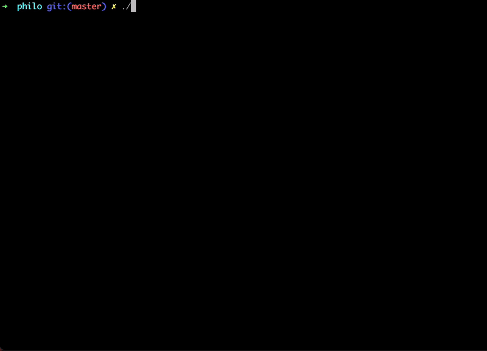

	
	
	
	
	

# **Philosophers**

## *Description*

	<b> This program is a simulation of the dining philosophers problem.     </b>
	

## *Overview*
	./philo [nb_of_philos] [t_to_die] [t_to_eat] [t_to_sleep] [number_of_times_each_philosopher_must_eat]

	<ul>
		<i>
			<li><b>nb_of_philos</b> :  The number of philosophers and also the number of <b>forks</b>.</li> 
			<li><b>t_to_die</b> (in milliseconds): If a philosopher didn’t start eating <b>t_to_die</b> milliseconds since the beginning of their last meal or the beginning of the simulation, they die.</li>  
			<li><b>t_to_eat</b> (in milliseconds): The time it takes for a philosopher to eat. During that time, they will need to hold <b>two forks</b>.</li>  
			<li><b>t_to_sleep</b> (in milliseconds):  The time a philosopher will spend sleeping.</li> 
			<li><b>number_of_times_each_philosopher_must_eat</b> (optional argument):  If all philosophers have eaten at least <b>number_of_times_each_philosopher_must_eat</b> times, the simulation stops. If not specified, the simulation stops when a philosopher dies.</li>
		</i>
	</ul>

